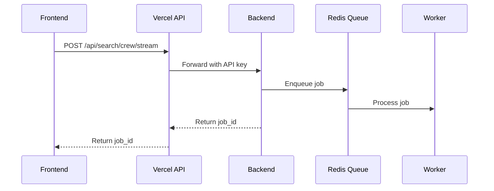
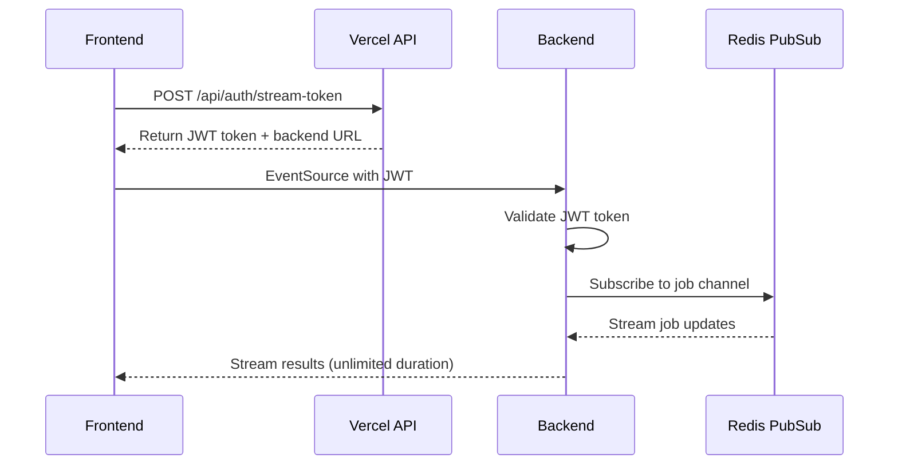

# System Architecture

This document explains the complete architecture of the Lexon legal knowledge graph platform, focusing on the streaming search system.

## 🏗️ Overall Architecture

```
┌─────────────┐    ┌─────────────┐    ┌─────────────┐
│   Frontend  │    │ Vercel API  │    │   Backend   │
│  (Next.js)  │────│   (Proxy)   │────│  (Fly.io)   │
└─────────────┘    └─────────────┘    └─────────────┘
       │                                      │
       │                                      ▼
       │                              ┌─────────────┐
       │                              │    Redis    │
       │                              │   (Queue)   │
       │                              └─────────────┘
       │                                      │
       │                                      ▼
       │                              ┌─────────────┐
       │                              │  Background │
       │                              │   Workers   │
       │                              └─────────────┘
       │                                      │
       │                                      ▼
       └──────── Direct Connection ──── ┌─────────────┐
              (JWT Authentication)      │   Streaming │
                                       │  Endpoint   │
                                       └─────────────┘
```

## 🔄 Request Flow

### 1. Job Enqueueing Flow



**Components:**
- **Frontend**: Initiates search request
- **Vercel API**: Secure proxy with API key authentication
- **Backend**: Creates job in Redis queue using RQ
- **Redis Queue**: Stores and manages background jobs
- **Worker**: Processes AI search jobs asynchronously

### 2. Streaming Flow



**Components:**
- **Vercel API**: Issues secure JWT tokens
- **Frontend**: Direct connection to backend
- **Backend**: Validates JWT and streams from Redis
- **Redis Pub/Sub**: Real-time job progress and results

## 🔐 Security Model

### Authentication Layers

1. **API Key Authentication**: For server-to-server communication
   - Vercel ↔ Backend communication
   - Applied to most backend routes

2. **JWT Token Authentication**: For streaming connections
   - Issued by Vercel after session validation
   - Job-specific tokens (can't be reused)
   - 30-minute expiration
   - Used only for streaming endpoints

3. **NextAuth Session + RBAC**: For user authentication + authorization
   - Session is required to access the app and to mint streaming tokens
   - Users have a `role` (`user`, `editor`, `developer`, `admin`) stored in Postgres
   - UI and Next.js API routes enforce role-based access (server-side checks are DB-backed)

### Security Benefits

- ✅ **No exposed credentials** in frontend
- ✅ **Job-specific access** (JWT tied to specific job ID)
- ✅ **Time-limited tokens** (30-minute expiration)
- ✅ **Separate authentication** for different use cases
- ✅ **CORS protection** for cross-origin requests

## 🏭 Backend Components

### Router Architecture

```python
# Main router - requires API key for all routes
router = APIRouter(dependencies=[Depends(get_api_key)])

# Streaming router - JWT authentication only  
streaming_router = APIRouter()

# Both included in main FastAPI app
app.include_router(router, prefix="/api/ai", tags=["AI"])
app.include_router(streaming_router, prefix="/api/ai", tags=["Streaming"])
```

### Job Queue System

```python
# Queue setup
redis_conn = Redis.from_url(os.getenv("REDIS_URL"))
search_queue = Queue("search_jobs", connection=redis_conn)

# Job processing
def run_search_crew(query: str, job_id: str):
    # 1. Initialize CrewAI agents
    # 2. Process search with MCP tools
    # 3. Publish progress to Redis channel
    # 4. Publish final results
```

### Streaming System

```python
# Redis pub/sub for real-time updates
async def event_stream():
    pubsub = redis_conn.pubsub()
    channel_name = f"job:{job_id}"
    await pubsub.subscribe(channel_name)
    
    # Stream messages until job completes
    while True:
        message = await pubsub.get_message()
        if message:
            yield f"data: {message['data']}\n\n"
```

## 🌐 Deployment Architecture

### Frontend (Vercel)
- **Environment**: Serverless functions
- **Timeout Limitation**: 60 seconds for functions
- **Role**: Authentication, JWT issuing, secure proxying
- **Scaling**: Automatic

### Backend (Fly.io)
- **Environment**: Persistent containers
- **No Timeout Limitation**: Long-running processes supported
- **Role**: Job processing, streaming, database connections
- **Scaling**: Manual/configurable

### Infrastructure Services
- **Redis**: Job queue + pub/sub (managed service)
- **Neo4j**: Knowledge graph database (managed service)
- **PostgreSQL**: User data, search history (managed service)

## 🚀 Performance Benefits

### Timeout Elimination
- **Before**: Vercel 60-second function timeout killed streams
- **After**: Direct backend connections support unlimited duration

### Scalability
- **Background Processing**: Jobs processed asynchronously
- **Multiple Workers**: Can scale job processing independently
- **Connection Pooling**: Efficient database connections

### User Experience
- **Real-time Updates**: Progress shown during processing
- **Concurrent Jobs**: Multiple users can search simultaneously
- **Reliable Streaming**: No connection drops from timeouts

## 🔧 Configuration

### Environment Variables

**Shared (Frontend + Backend):**
- `JWT_SECRET`: Must be identical for token validation

**Frontend Specific:**
- `AI_BACKEND_URL`: Points to backend for direct connections
- `NEXTAUTH_SECRET`: Session management
- `DATABASE_URL`: Prisma/NextAuth storage (**recommended `?schema=auth`**)

**Backend Specific:**
- `FASTAPI_API_KEY`: Server-to-server authentication
- `REDIS_URL`: Job queue and pub/sub
- `NEO4J_URI`: Knowledge graph database
- `OPENAI_API_KEY`: AI model access
- `POSTGRES_SCHEMA`: Backend-owned Postgres schema (recommended `app`)

This architecture provides a robust, scalable, and secure foundation for long-running AI-powered search operations while maintaining excellent user experience. 