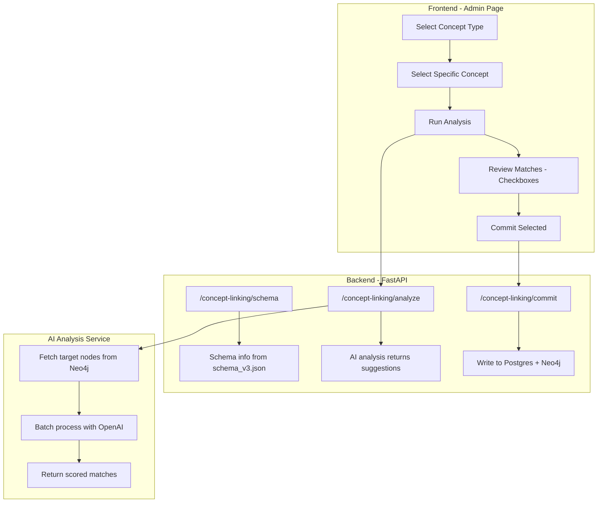

# Concept Auto-Linking

This document describes the concept auto-linking feature, which allows administrators to retroactively link shared concepts (Doctrines, Policies, FactPatterns, Laws) to existing case data using AI-powered analysis.

## Overview

When new shared nodes are added to the knowledge graph (e.g., a new Doctrine), they won't automatically be connected to existing case data. The concept auto-linking feature solves this by:

1. Using AI to analyze existing case nodes (Arguments, Issues, Rulings)
2. Suggesting which nodes should be linked to the concept
3. Allowing admin review before committing relationships
4. Writing approved relationships to both Neo4j and Postgres

## Architecture



## Valid Relationships

The following relationships are supported for concept linking (derived from `schema_v3.json`):

| Concept Type | Can Link To | Relationship Label |
|--------------|-------------|-------------------|
| Doctrine | Issue, Argument | RELATES_TO_DOCTRINE |
| Policy | Issue, Argument | RELATES_TO_POLICY |
| FactPattern | Issue, Argument | RELATES_TO_FACTPATTERN |
| Law | Ruling | RELIES_ON_LAW |

## Schema-Driven Design

The feature is fully schema-driven - all concept types and valid relationships are derived from `schema_v3.json` at runtime. If the schema changes:

- New concept types will automatically appear in the UI
- New relationships will be recognized
- Removed relationships will be unavailable

## Usage

### 1. Navigate to Concept Linking

Go to `/admin/concept-linking` in the admin interface.

### 2. Select Concept Type

Choose the type of concept you want to link:
- **Doctrine** - Legal doctrines and principles
- **Policy** - Policy considerations
- **FactPattern** - Recurring factual patterns
- **Law** - Statutes, regulations, constitutional provisions

### 3. Select Specific Concept

Search for and select the specific concept you want to link. The UI shows:
- Concept name and description
- Current connection count
- Which node types it can link to

### 4. Run Analysis

Click "Run AI Analysis" to analyze existing case data. The system will:

1. Fetch all Arguments/Issues/Rulings that don't already have this relationship
2. Process them in batches of 20 using OpenAI
3. Return matches with confidence levels:
   - **High** - Clear, explicit reference or relevance
   - **Medium** - Implicit relevance
   - **Low** - Tangential connection

### 5. Review Matches

Review the suggested matches. For each match, you can see:
- Node type (Argument, Issue, Ruling)
- Case name
- Text preview
- Confidence level
- AI reasoning

Use the quick-select buttons to:
- Select/deselect all
- Select by confidence level

### 6. Commit Selected

Click "Commit Selected Matches" to create the relationships. This:
- Creates edges in Neo4j
- Updates `cases.extracted` JSON in Postgres
- Updates `cases.kg_extracted` if the case has been published

## API Endpoints

### GET `/api/ai/concept-linking/schema`

Returns schema information for concept linking.

**Response:**
```json
{
  "success": true,
  "linkableConcepts": {
    "Doctrine": ["Issue", "Argument"],
    "Policy": ["Issue", "Argument"],
    "FactPattern": ["Issue", "Argument"],
    "Law": ["Ruling"]
  },
  "conceptProperties": {...},
  "relationships": {
    "Issue->Doctrine": "RELATES_TO_DOCTRINE",
    ...
  }
}
```

### GET `/api/ai/concept-linking/concepts/{label}`

List all concepts of a given type.

**Parameters:**
- `label` - Concept type (Doctrine, Policy, FactPattern, Law)
- `limit` - Maximum results (default 100)

**Response:**
```json
{
  "success": true,
  "label": "Doctrine",
  "concepts": [
    {
      "id": "doc-123",
      "name": "Market Power",
      "description": "The ability to control prices...",
      "connectionCount": 15
    }
  ],
  "targets": ["Issue", "Argument"]
}
```

### GET `/api/ai/concept-linking/concepts/{label}/{conceptId}/target-counts`

Get counts of potential target nodes for analysis.

**Response:**
```json
{
  "success": true,
  "conceptLabel": "Doctrine",
  "conceptId": "doc-123",
  "targetCounts": {
    "Argument": 342,
    "Issue": 156
  },
  "totalTargets": 498
}
```

### POST `/api/ai/concept-linking/analyze`

Run AI analysis to find matching nodes.

**Request:**
```json
{
  "conceptLabel": "Doctrine",
  "conceptId": "doc-123",
  "batchSize": 20,
  "maxNodes": 1000
}
```

**Response:**
```json
{
  "success": true,
  "conceptLabel": "Doctrine",
  "conceptId": "doc-123",
  "conceptName": "Market Power",
  "totalAnalyzed": 498,
  "matches": [
    {
      "nodeId": "arg-456",
      "nodeLabel": "Argument",
      "caseId": "case-789",
      "caseName": "United States v. Example Corp",
      "nodeTextPreview": "The defendant's control over...",
      "confidence": "high",
      "reasoning": "Explicitly discusses market power as central argument"
    }
  ],
  "matchCount": 47,
  "highConfidenceCount": 12,
  "mediumConfidenceCount": 25,
  "lowConfidenceCount": 10
}
```

### POST `/api/ai/concept-linking/commit`

Commit approved matches to Postgres and Neo4j.

**Request:**
```json
{
  "conceptLabel": "Doctrine",
  "conceptId": "doc-123",
  "matches": [
    {
      "nodeId": "arg-456",
      "nodeLabel": "Argument",
      "caseId": "case-789"
    }
  ]
}
```

**Response:**
```json
{
  "success": true,
  "neo4jRelationshipsCreated": 35,
  "postgresCasesUpdated": 28
}
```

## Implementation Details

### Backend Files

| File | Purpose |
|------|---------|
| `ai-backend/app/lib/concept_linking/__init__.py` | Package exports |
| `ai-backend/app/lib/concept_linking/schema_parser.py` | Parse schema_v3.json for relationships |
| `ai-backend/app/lib/concept_linking/analysis_service.py` | OpenAI-based matching logic |
| `ai-backend/app/lib/concept_linking/commit_service.py` | Write to Postgres and Neo4j |
| `ai-backend/app/routes/concept_linking.py` | FastAPI endpoints |

### Frontend Files

| File | Purpose |
|------|---------|
| `src/app/admin/concept-linking/page.tsx` | Admin wizard UI |
| `src/app/api/admin/concept-linking/schema/route.ts` | Next.js proxy |
| `src/app/api/admin/concept-linking/concepts/[label]/route.ts` | List concepts proxy |
| `src/app/api/admin/concept-linking/concepts/[label]/[conceptId]/route.ts` | Concept detail proxy |
| `src/app/api/admin/concept-linking/concepts/[label]/[conceptId]/target-counts/route.ts` | Target counts proxy |
| `src/app/api/admin/concept-linking/analyze/route.ts` | Analysis proxy |
| `src/app/api/admin/concept-linking/commit/route.ts` | Commit proxy |

### Key Design Decisions

1. **Separate from case extraction** - The concept linking code is completely independent from `flow_cases/`. It doesn't reuse any case extraction code.

2. **Direct OpenAI, not CrewAI** - Uses OpenAI API directly for simpler, faster analysis without the overhead of CrewAI agents.

3. **Two-phase commit** - AI suggests matches (read-only), then admin approves and commits (writes). This ensures human verification.

4. **Batch processing** - Processes nodes in batches of ~20 to stay within token limits and provide progress feedback.

5. **Conservative matching** - The AI prompt emphasizes being conservative - only marking matches when there's a clear connection.

## Testing

Backend tests are in `ai-backend/tests/test_concept_linking.py`:

```bash
cd ai-backend
poetry run pytest tests/test_concept_linking.py -v
```

## Troubleshooting

### Analysis takes too long

- Reduce `maxNodes` parameter (default 1000)
- Increase `batchSize` parameter (default 20)
- Filter by selecting specific cases in the future (feature enhancement)

### No matches found

- Verify the concept has a meaningful name and description
- Check that target nodes exist and haven't already been linked
- Review the concept description - it should contain keywords the AI can match against

### Commit failures

- Check Neo4j connection
- Verify Postgres connection
- Check the case still exists in the database
- Review error messages in the response

## Future Enhancements

1. **Filter by case** - Allow analyzing only specific cases
2. **Streaming progress** - Real-time progress updates during analysis
3. **Batch commit** - Process very large match sets in batches
4. **History/audit** - Track who linked what and when
5. **Undo** - Allow reverting committed links
